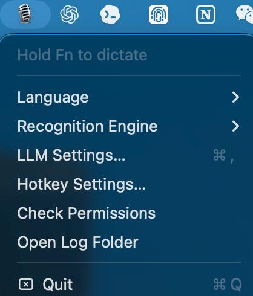

# VoiceInput

A lightweight macOS 14+ menu-bar push-to-talk dictation app.

Thanks to [yetone/voice-input-src](https://github.com/yetone/voice-input-src); this project is based on it with feature modifications.

Default engine: **Apple Speech Recognition** (`zh-CN` by default).

Selectable recognition engines:

1. **Auto** — Apple Speech → Local mlx-whisper → External LLM.
2. **Apple Speech** — system Speech framework only. This is the default.
3. **Local mlx-whisper** — record locally, then transcribe with `~/.local/bin/local-transcribe`.
4. **External LLM** — reserved for user-configured external LLM testing.

Optional **OpenAI-compatible LLM refinement** conservatively fixes only obvious ASR mistakes before inserting text.

Hold **Fn** to record; release to paste the final text into the currently focused input field. Use **Hotkey Settings…** to change the push-to-talk shortcut.



## Features

- Menu-bar-only app (`LSUIElement`, no Dock icon).
- Default language: Simplified Chinese (`zh-CN`).
- Language menu: English, Simplified Chinese, Traditional Chinese, Japanese, Korean.
- Recognition Engine menu: Auto, Apple Speech, Local mlx-whisper, External LLM. Apple Speech is selected by default.
- Bottom-center frameless capsule panel with live partial transcript and RMS-driven waveform bars.
- Clipboard + simulated Cmd+V injection.
- CJK input-source detection; switches to ABC/US before paste and restores original input source afterwards.
- LLM Settings window for API Base URL, API Key, and Model.
- Hotkey Settings window: Fn, Right Option, Control + Space, or Command + Shift + Space. Fn is selected by default.
- API key stored in macOS Keychain; clearing the field deletes it from Keychain.
- LLM timeout defaults to 2.5s and falls back to original transcript on error/timeout.
- Logs to `~/Library/Logs/VoiceInput/voiceinput.log` without transcript contents by default.

## Direct Download / Use

If you only want to try the app directly, download the packaged app archive from
the [GitHub Releases](https://github.com/perryyeh/macos-voicepinput/releases)
page.

Then:

1. Download `VoiceInput.app.zip` from the latest release.
2. Unzip it.
3. Move `VoiceInput.app` to `/Applications` or run it from the unzipped folder.
4. On first run, grant Microphone, Speech Recognition, and Accessibility permissions.

If macOS Gatekeeper blocks the ad-hoc signed app, right-click `VoiceInput.app` and choose **Open**, or allow it from System Settings → Privacy & Security.

### Upgrading from an older build

Use one stable app location, preferably `/Applications/VoiceInput.app`. Before replacing an older copy, quit the running app:

```bash
pkill -x VoiceInput || true
```

Then replace the app bundle and open the new copy from the same path:

```bash
open /Applications/VoiceInput.app
```

If Accessibility still shows VoiceInput as enabled in System Settings but the app reports that Accessibility is not trusted, the macOS TCC permission record is probably stale. This can happen with ad-hoc signed builds because every new build may have a different code hash, so the old Accessibility entry can remain visible while no longer matching the current app.

Reset only VoiceInput's Accessibility permission and grant it again:

```bash
pkill -x VoiceInput || true
tccutil reset Accessibility local.voiceinput.app
open /Applications/VoiceInput.app
```

Then open:

```text
System Settings → Privacy & Security → Accessibility
```

Remove any old `VoiceInput` entries if present, add the current `/Applications/VoiceInput.app`, and turn it on again. Avoid keeping multiple copies such as both `~/Downloads/VoiceInput.app` and `/Applications/VoiceInput.app`, because macOS can show one copy as authorized while the running copy is a different app path/signature.

### Signing and notarization status

Release archives are currently ad-hoc signed, not Developer ID signed or notarized. This is acceptable for local/self use, but it has two side effects:

1. GitHub/browser downloads may get a `com.apple.quarantine` flag and trigger Gatekeeper's "Apple could not verify" warning.
2. Accessibility permission may need to be reset after upgrading if macOS keeps an old TCC record for a previous ad-hoc build.

For stable public distribution, sign with an Apple Developer ID certificate and notarize the archive. A Developer ID signed and notarized build gives macOS a stable code identity and reduces both Gatekeeper warnings and stale Accessibility authorization problems.

## Build / Run

```bash
make test
make build
make run
make install
make clean
```

The app bundle is ad-hoc signed by `make build`.

## Permissions

On first run, grant:

- Microphone
- Speech Recognition
- Accessibility for global Fn detection and paste simulation

If Fn detection or paste does not work, open:

```text
System Settings → Privacy & Security → Accessibility
```

Input Monitoring is not required by the current build; it is normal if VoiceInput does not appear in the Input Monitoring list.

## Logs and crash reports

VoiceInput writes diagnostic logs to:

```text
~/Library/Logs/VoiceInput/voiceinput.log
```

The menu-bar item also has **Open Log Folder**. If the app crashes on another Mac, please copy this log file and the latest macOS crash report if present:

```bash
cp ~/Library/Logs/VoiceInput/voiceinput.log ~/Desktop/voiceinput.log
ls -t ~/Library/Logs/DiagnosticReports/VoiceInput*.crash 2>/dev/null | head -1
```

The app logs lifecycle, permissions, hotkey press/release, selected recognition backend, target app, paste simulation steps, and uncaught `NSException` details. Transcript text is not written to the log by default; only text lengths are logged.

## mlx-whisper fallback

The fallback expects the existing local helper:

```bash
~/.local/bin/local-transcribe <audio-file> [model]
```

Default model used by the app:

```text
mlx-community/whisper-medium
```

If the helper is absent, the app simply skips mlx-whisper fallback.

## LLM Settings

Menu bar → `LLM Settings…`:

- Configure API Base URL, API Key, Model.
- API Key is stored in macOS Keychain.

The app calls:

```text
<API Base URL>/chat/completions
```

with an OpenAI-compatible request. The system prompt is intentionally conservative: only obvious speech-recognition mistakes are fixed; no rewriting, polishing, summarizing, or content removal.

## Current caveats

- Fn/Globe handling differs across macOS versions and keyboards; Accessibility permission is required. If Fn conflicts with macOS, change it in Hotkey Settings.
- Apple Speech is the default real-time engine.
- Auto mode falls back from Apple Speech to Local mlx-whisper, then to External LLM.
- Local mlx-whisper mode records first, then transcribes after release.
- External LLM is scaffolded for user testing/configuration.
- Clipboard restoration preserves pasteboard items, but clipboard-manager apps may still observe transient text.
